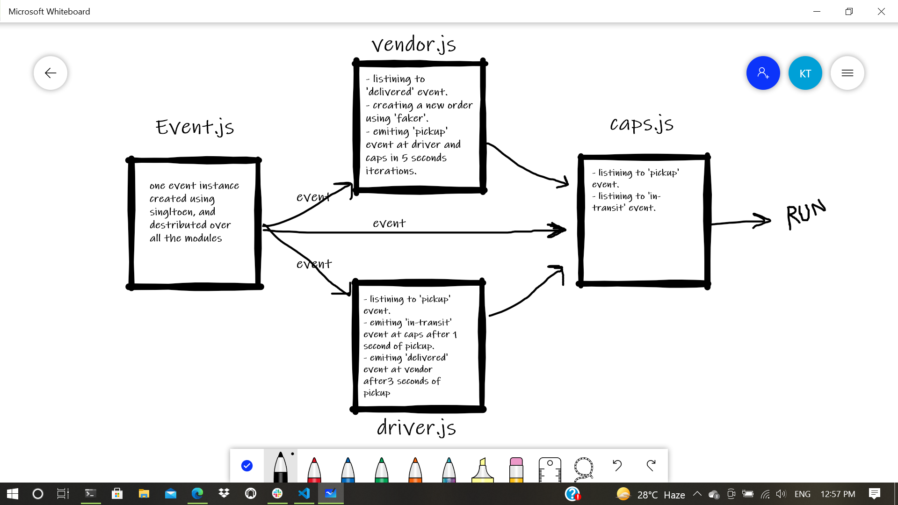

# LAB - 11

## Author: Khaled Tahat

## Setup

- .env requirements
- SHOP_NAME = flower shop

- Running the app

  - node caps.js

- output shape:

```
    EVENT { event: 'pickup',
    time: 2020-03-06T18:27:17.732Z,
    payload:
     { store: flower shop,
       orderID: 17187-3529,
       customer: Martha Hartmann,
       address: Port NellaTexas }}
Driver: picked up 17187-3529
EVENT { event: 'in-transit',
    time: 2020-03-06T18:27:18.738Z,
    payload:
     { store: flower shop,
       orderID: 17187-3529,
       customer: Martha Hartmann,
       address: Port NellaTexas }}
DRIVER: delivered up 17187-3529
VENDOR: Thank you for delivering  17187-3529
EVENT { event: 'delivered',
  time: 2020-03-06T18:27:20.736Z,
  payload:
   { store: flower shop,
     orderID: 17187-3529,
     customer: Martha Hartmann,
     address: Port NellaTexas }}
```

UML


<br />
<br />
## Queue Server

I added the queue server in seperate js file rather then have it inside the hub (caps.js), so all the clients (vendor and driver) are communicating through the hub, and we can consider queue.js as a third party client that  helps with maneging the orders and messages in the application and it's communicating directly with the hub.

The hub is just managing connections between clients by redirecting the requests and messages around.

- after running all the servers the queue will start adding orders then after the vendor recives the message teh queue will delete the order, and we can see the output in queue.js console as follows: <br />
```
add to queue 😲 0bac93ca-c83e-4ba2-8788-d5c24d3bd434, order ID: 49147
deleting 0bac93ca-c83e-4ba2-8788-d5c24d3bd434 from Queue . . .
add to queue 😲 865bc445-3ac4-45a5-8a44-d801681be9d5, order ID: 59909
deleting 865bc445-3ac4-45a5-8a44-d801681be9d5 from Queue . . .
add to queue 😲 de51df1a-6815-44fc-a24a-fa93a81f7cf6, order ID: 27140
deleting de51df1a-6815-44fc-a24a-fa93a81f7cf6 from Queue . . .
add to queue 😲 927ef4b5-114c-4441-b967-bb29dba4e3df, order ID: 71166-0419
deleting 927ef4b5-114c-4441-b967-bb29dba4e3df from Queue . . .
```
- and this happens when we have vendor connected to the hub, once the vendor went offline the queue will start adding orders without deleting cause the vendor still didn't recive the message, and we will see the next output: <br />
```
add to queue 😲 9f4858c2-a5ae-463b-ab1f-cd84b22ad68c, order ID: 91046-2404
add to queue 😲 52906060-2aeb-4744-be66-1c8ff5a7874e, order ID: 35382
add to queue 😲 d4facf40-12f6-4a50-969d-5fa8c96b87b9, order ID: 01474
add to queue 😲 16ca73c9-efcd-41b5-8516-a7ed4f9b8e35, order ID: 04473
add to queue 😲 7298fea1-d2c1-4f7e-82fa-2411feb06886, order ID: 79869
add to queue 😲 632be51d-05c9-48d1-a4f5-2f2747a27333, order ID: 67654-1037
add to queue 😲 4bcfec87-fa8a-4c0d-a972-d0b363915910, order ID: 78857-1993
```

- once the vendor went live again, the queue will bring all the missed orders messages back to him and it will delete them, and we will see the following output:<br />
```
deleting 9f4858c2-a5ae-463b-ab1f-cd84b22ad68c from Queue . . .
deleting 52906060-2aeb-4744-be66-1c8ff5a7874e from Queue . . .
deleting d4facf40-12f6-4a50-969d-5fa8c96b87b9 from Queue . . .
deleting 16ca73c9-efcd-41b5-8516-a7ed4f9b8e35 from Queue . . .
deleting 7298fea1-d2c1-4f7e-82fa-2411feb06886 from Queue . . .
deleting 7298fea1-d2c1-4f7e-82fa-2411feb06886 from Queue . . .
```

